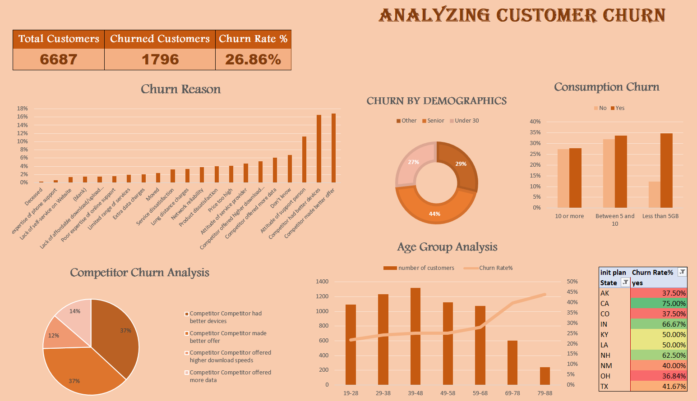

# Customer Churn Analysis

An end-to-end **customer churn analysis** case study for **Databel**, completed using Microsoft Excel.

## Dashboard

## 📌 Project Overview

The goal of this project is to analyze customer churn, identify the main factors behind customer loss, and present the findings through an interactive dashboard to support better retention decisions.

## 🔍 Analysis Workflow

The project follows the main data analysis steps:

1. **Data Cleaning & Transformation** — cleaned the dataset and created calculated columns.
2. **Exploratory Data Analysis** — explored churn patterns across customer and subscription attributes.
3. **PivotTables** — summarized and analyzed the data using PivotTables.
4. **Data Visualization** — created charts, KPIs, and interactive slicers in an Excel dashboard.
5. **Insight Communication** — used the final dashboard to communicate key churn findings and support data-driven decisions.

## 📊 What I Learned

Through this case study, I practiced:

- Creating and using **calculated columns**
- **Data transformation and cleaning**
- Performing **Exploratory Data Analysis (EDA)**
- Creating and analyzing **PivotTables**
- Building **charts and interactive dashboards**
- Using **slicers** to explore customer segments
- Turning analysis results into **actionable insights**

## 🛠️ Tools

- Microsoft Excel
- PivotTables & PivotCharts
- Excel Charts
- Slicers
- Calculated Columns

## 📁 Files

- `dataset.xlsx` — Raw customer churn dataset
- `customer_churn_analysis.xlsx` — Final analysis, PivotTables, charts, and dashboard
- `Metadata Sheet - Customer Churn.pdf` — Data dictionary and field descriptions

## 🎯 Final Deliverable

The final Excel dashboard allows Databel to explore customer churn across different segments and better understand the factors contributing to churn.
